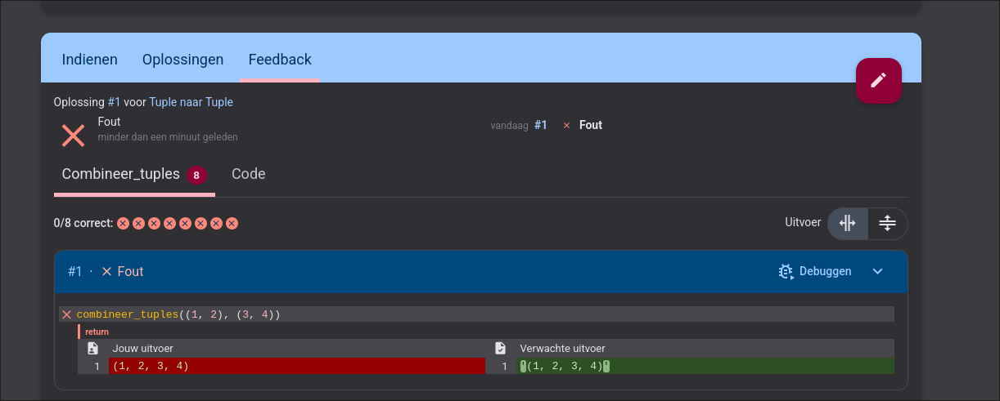

# Herexamens oefeningen orientatiestage

Ik merkte dat dodona bij tuple returns moeilijk doet.

## Opmerkingen

Ik heb amper oefeningen op binair zoeken gemaakt omdat ik het gevoel had dat ik letterlijk weer exact dezelfde oefeningen zou moeten maken van de eerste examentijd.
Daarom zijn er disproportioneel veel oefeningen op tuples en insertie in gesorteerde lijsten aanwezig.
Ik heb echter wel nog een paar toffe en leerrijke ideeen op lineair en binair zoeken uitgewerkt.
Zoals gevraagd is dit een mengelmoes van introductieoefeningen en meer pittige oefeningen.

## Structuur

Dit is een repo die geimporteerd is op mijn dodona, in `excercises` vind je al de oefeningen die ik heb gemaakt. In die map vind je dan een opgave, modeloplossing en testcases

## Generatieve AI transparantie

Ik heb extensief gebruik gemaakt van AI voor het opstellen van testcases, voor inspiratie op te doen en voor het duidelijk verwoorden van opgaves.
